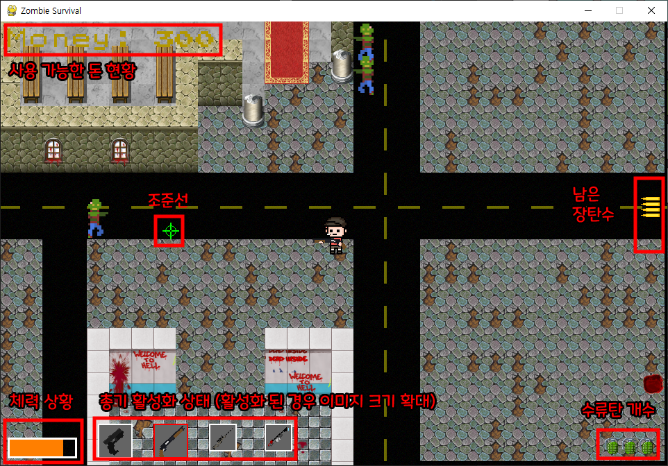
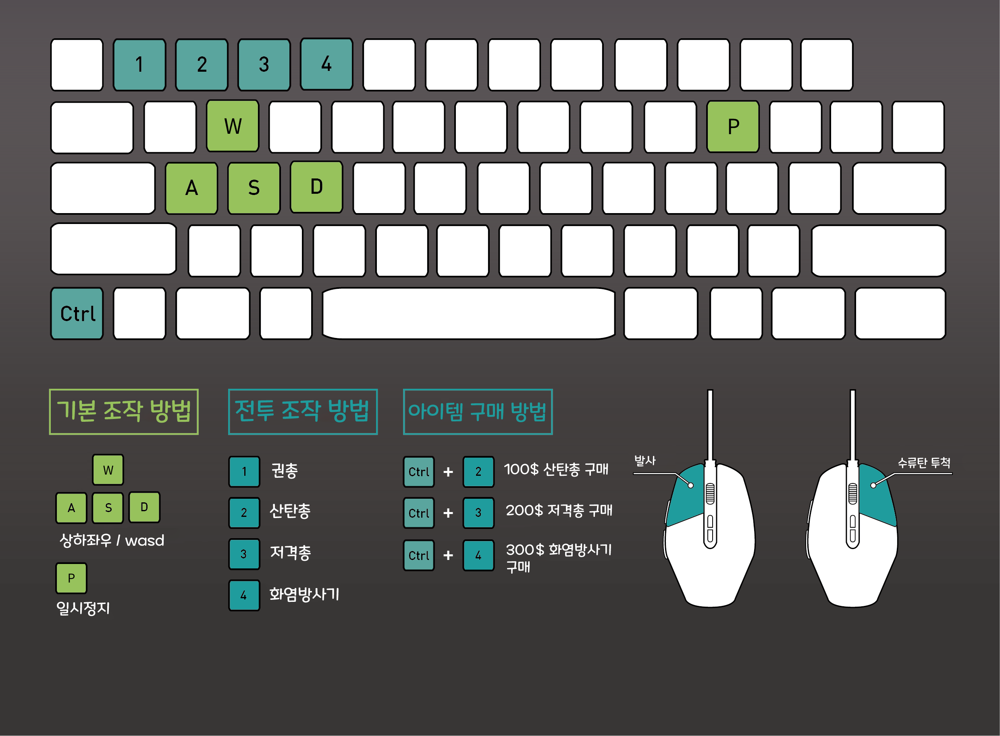

# 🧟‍♂️Zombie Survival🧟‍♀️  

# 📖게임 설명
세상이 좀비로 뒤덮였다!  
좀비를 처치하고, 살아남아라!  
  

# 🎮How to play
  
  
# 📦Items
특정 시간동안 이동속도 증가  
수류탄 3개 추가  
특정 시간동안 공격력 증가  
체력 회복  
방어력 추가  

# 🛠 Requirements
pygame==2.3.0  
PyTMX==3.31  
pytweening==1.0.4  

pip install -r requirements.txt
이용하여 패키지 다운로드

# 🤝 Contributers

<table class="tg">
<tbody>
    <tr>
        <td>강승환</td>
        <td>정지원</td>
        <td>정순인</td>
    </tr>
    <tr>
        <td><a href="https://github.com/kangshwan">@kangshwan</a></td>
        <td><a href="https://github.com/cjw9506">@cjw9506</a></td>
        <td><a href="https://github.com/JungSoonIn">@JungsoonIn</a></td>
    </tr>
</tbody>
</table>
